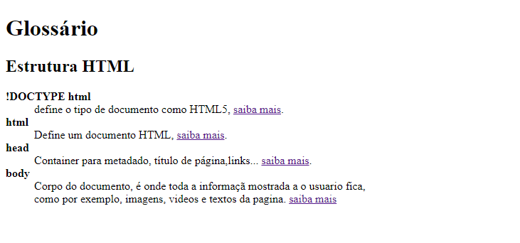

# # Desafio de html
    Desafios que fiz apos estudar html na plataforma Rocketseat
    O primeiro desafio consiste em fazer um glossário com uma data list e colocar links para quem queira saber mais sobre o assunto.
